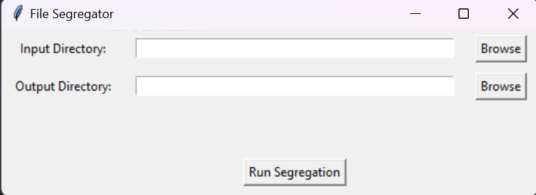

# Organize Files by Date EXIF Metadata

**A Python script to automatically organize files into nested timestamped folders based on creation date, EXIF 
data, 
or filename patterns.**

## Description

This tool helps you categorize files—especially images and videos—into date-based folders. It uses EXIF metadata, 
file creation dates, and filenames to segregate your files into a three-level directory structure (Year/Month). 
If it cannot extract date information, the file is moved to an "Unknown" folder. Backup folders are also 
created with timestamps for safe storage.   

Program can be run repeatedly on an output folder to segregate a new input folder and seamlessly merge the 
generated output with the existing output folder from a previous run.

## Setup

1. Clone the repository.
2. Install dependencies using: `pip install -r requirements.txt`

## Usage

Run the script with the following options:

`python segregator.py --input_dir <absolute_path_to_input_dir> --output_dir 
<absolute_path_to_output_dir> --verbose <0/1>`

### Options:

    --input_dir : Directory containing the files to be segregated.
    --output_dir : Directory where segregated files will be stored.
    --verbose : Set to 1 to enable detailed logs (optional).

## How it Works

1. Backup: Creates timestamped backups of the input/output directories, which are sibling folders to these.
2. Segregation: The program tries to compute month and year in a three stage approach as follows:
    * **Stage 1- Filename**: First the program looks for year in the folder name of a file's full path. If not 
      found, it 
      looks for year in the filename itself. If still not found, it moves to the next step. Else, a regex looks 
      for month name in the filename failing which we try using exif for just the month, having already derived 
      year from somewhere in the filepath. If exif doesn't give us the month properly, the file is stored 
      directly in the year folder.
    * **Stage 2- EXIF data**: We use PyExifTool to extract date information (both month and year) from the file.
      In the previous stage, exif was used only for the month.
    * **Stage 3- Creation date**: In Windows, we use os.path.ctime() function to extract creation date. In Linux, this 
      step is more unreliable. We first try stat.st_birthtime. If still not available, we use stat.st_mtime 
      (modification time). This program itself may change the modification time, but it shouldn't be a problem 
      since the file would be somewhere inside a "year" folder after execution, leading to stage 1 or 2 succeeding.
    * If all three stages fail, the file is moved to an "Unknown" folder.
3. Folder Structure: Files are moved into Year/Month folders. If date extraction fails, they are placed in an 
   "Unknown" folder. If only month extraction fails, they are placed directly in the "Year" folder.
4. Logs: A file named assumptions.txt logs any assumptions made during segregation, such as months or years 
   being guessed without much confidence.
5. If the input folder does not exist, an error is thrown. If the output folder does not exist, a new one is 
   created to store the output. If the output folder provided as an argument already existed before this 
   program was run, the new output generated from input is merged with the existing output.
6. After the program, the original input folder is deleted while the output folder contains the output or the 
   combined output mentioned in the previous point. To restore original input/output folders, go to the backup 
   folders created in step 1.
7. Regardless of verbosity, the program prints file count of input/output folders before and after running.
8. **Note that files with the same name will be duplicated in the output folder with a numbered suffix, like (1)
   , (2), etc.**

## Sample Output

Input:

```
input_dir/
├── IMG_20210912_120000.jpg
├── embedded_exif_date_pic.png
├── video_2020.mp4
└── corrupted_pic.jpg

<output_dir> not existing
```

Run command: `python segregator.py --input_dir input_dir --output_dir output_dir`

Output:
```
output_dir/
├── 2021/
│   └── Sep/
│       └── IMG_20210912_120000.jpg
│   └── Aug/
│       └── embedded_exif_date_pic.png
├── 2020/
│   └── video_2020.mp4
└── Unknown/
    └── corrupted_pic.jpg
```
In the above example, `output_dir` did not exist, so it was created. For `video_2020.mp4`, the program recognised 
the year from the filename, but no exif entry was found. For `corrupted_pic.jpg`, no date is mentioned in the  
input's filepath, thus moved to "Unknown" folder. For `embedded_exif_date_pic.png`, the program used exif to 
extract the date information. For `IMG_20210912_120000.jpg`, the filename was used to extract the date. 

Now consider the following input, after the previous run:
```
new_input_dir/
├── IMG_20220912_120000.jpg
├── embedded_exif_date_pic.png
└── corrupted_pic2.jpg

output_dir/
├── 2021/
│   └── Sep/
│       └── IMG_20210912_120000.jpg
│   └── Aug/
│       └── embedded_exif_date_pic.png
├── 2020/
│   └── video_2020.mp4
└── Unknown/
    └── corrupted_pic.jpg
```

Run command: `python segregator.py --input_dir new_input_dir --output_dir output_dir`

Output:
```
output_dir/
├── 2022/
│  └── Sep/
│       └── IMG_20220912_120000.jpg
├── 2021/
│   └── Sep/
│       └── IMG_20210912_120000.jpg
│   └── Aug/
│       └── embedded_exif_date_pic.png
│       └─── embedded_exif_date_pic (1).png
├── 2020/
│   └── video_2020.mp4
└── Unknown/
    └── corrupted_pic.jpg
    └── corrupted_pic2.jpg
```

In the above example, `output_dir` already existed, so new generated output on `new_input_dir` would be merged 
into this existing output folder. `embedded_exif_date_pic.png` was renamed by adding a numbered suffix (1) 
since it already existed in `output_dir`. A new year and month folder was created in `output_dir` for `IMG_20220912_120000.jpg` (2022, Sep) 
to be stored. `corrupted_pic2.jpg` was added to `Unknown` folder.

## GUI

You can run the tkinter based GUI by running the script: `python segregator_gui.py`, which simply uses this 
underlying code while providing folder pickers for the arguments, and disables verbosity. Usual console logs 
like directory stats will be logged as usual. 

## Releases

You can download the latest version of the executable from our 
[Releases page](https://github.com/sriramcu/segregate_by_date/releases). The exe behaves exactly the 
same as the GUI script. No need for setup, the exe is self-contained. In case Microsoft Defender throws any 
errors, exclude this file 
[by following these steps](https://support.microsoft.com/en-us/windows/add-an-exclusion-to-windows-security-811816c0-4dfd-af4a-47e4-c301afe13b26)
.

You can generate your own exe by following the setup steps, pip installing pyinstaller and then running 
`pyinstaller --onefile --noconsole segregator_gui.py`.

A screenshot of the GUI and the exe can be seen below:

